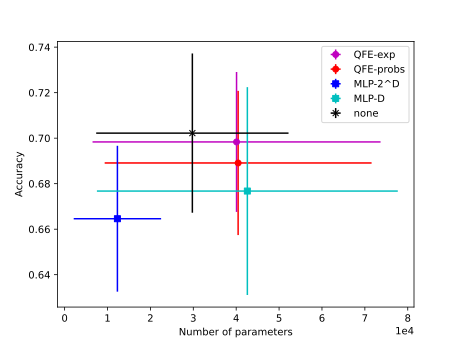
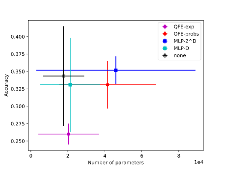

# Hybrid Quantum or Purely Classical? Assessing the Utility of Quantum Feature Embeddings

Paper: [](https://doi.org/10.12688/f1000research.154428.1)<br />
Data and Code Archive: [](https://zenodo.org/doi/10.5281/zenodo.13117644)

This repository is the official implementation of ["Hybrid Quantum or Purely Classical? Assessing the Utility of Quantum Feature Embeddings" written by J. Simon Richard](https://doi.org/10.12688/f1000research.154428.1). 

Cite:
```
Richard JS. Hybrid Quantum or Purely Classical? Assessing the Utility of Quantum Feature Embeddings [version 1; peer review: awaiting peer review]. F1000Research 2024, 13:961 (https://doi.org/10.12688/f1000research.154428.1)
```

This paper shows that higher performing and more efficient models can be achieved without the use of quantum machine learning, as suggested by Xu et al. in their paper [Quantum Feature Embeddings for Graph Neural Networks](https://hdl.handle.net/10125/107303).

## Requirements

This project uses Docker Compose to run a Postgres database for Optuna. To install Docker Compose, follow the instructions [here](https://docs.docker.com/compose/install/).

We also recommend creating a new python environment using `conda` or `virtualenv`. To create a new `virtualenv` environment named `qfe_exp_env`, run the following command:
```bash
python -m venv qfe_exp_venv
source qfe_exp_venv/bin/activate
```

### Installing the virtual environment into Jupyter

To use the `virtualenv` environment in Jupyter/JupyterLab (not VSCode), run the following command while the venv is activated:
```bash
python -m ipykernel install --user --name=qugcn_venv
```
Do not do this if using VSCode; it will detect the python venv on its own. Installing the kernel will just make it show up twice.

### Installing pip requirements

```setup
pip install -r requirements.txt
```
If you find that a dependency is missing from `requirements.txt`, please open an issue or PR.


## Data

This project uses the `PROTEINS` and `ENZYMES` datasets from http://graphlearning.io. Since both of these are included in the [PyTorch Geometric](https://pytorch-geometric.readthedocs.io/en/latest/notes/datasets.html) library, you do not have manually download them. Instead, just run any of the scripts in this repo and the datasets will be automatically downloaded into the `data/` directory.


## Training

First, you will need to run hyperparameter tuning using Optuna. Alternatively, you can download the hyperparameters from [Zenodo](https://zenodo.org/records/13117645).

To run the Optuna studies, you will first need to start the PostgreSQL database for Optuna. That can be done using the following command:
```bash
docker compose up -d
```

Then you can start the studies on the PROTEINS dataset (or the ENZYMES dataset, by replacing "PROTEINS" with "ENZYMES") using the following command: 
```bash
python run_studies.py -d PROTEINS
```
This will run five-fold cross-validation for each embedder type proposed in the paper:
* QFE-exp
* QFE-probs
* MLP-2^D
* MLP-D
* none

> **Note:** For any of the python scripts in this repo, you can use the `-h` flag to see the available options.

To view the progress of the studies in real time, you can use the following command:
```bash
./optuna_dashboard.sh
```

Once the studies are complete, use the following command to extract the study data from the Optuna database:
```bash
python get_data_from_optuna.py -d PROTEINS
```
The results will be saved to `./study_outputs/dataset-PROTEINS/study_data.json`.

Once this is complete, you can close the Optuna database using the following command:
```bash
docker compose down
```

Next, you will need to retrain the best models found by Optuna. This can be done using the following command:
```bash
python train_from_study_data.py -d PROTEINS
```
The model weights will be saved in `./study_outputs/dataset-PROTEINS/`.

### Training single models

If you wish to train one model at a time, you can use the `train.py` script. Run the following command to learn more about the available options:
```bash
python train.py --help
```

### Reproducibility

I was unable to achieve completely reproducible training on my machine; your milage may vary.


## Evaluation

To evaluate each of the five-fold cross-validation models on their respective test datasets, run the following command:
```bash
python eval_from_study_models.py -d PROTEINS
```

### Evaluating single models

To evaluate a single model, the `eval.py` script can be used. Run the following command to learn more about the available options:
```bash
python eval.py --help
```


## Model Weights

You can download the model weights we used on [Zenodo](https://zenodo.org/records/13117645).


## Results

The following images were generated using the [visualize_results.ipynb](visualize_results.ipynb) notebook, and can be found (along with more results figures) in the [generated_images](generated_images) directory.

Using the `best_all` utility function, we achieve the following performance on the PROTEINS dataset:


Using the `best_all` utility function, we achieve the following performance on the ENZYMES dataset:


More results are discussed in the paper.


## Contributing

This repository is released under the MIT license. See [LICENSE](LICENSE) for additional details.

Please don't hesitate to open an issue or pull request if you find a bug.
